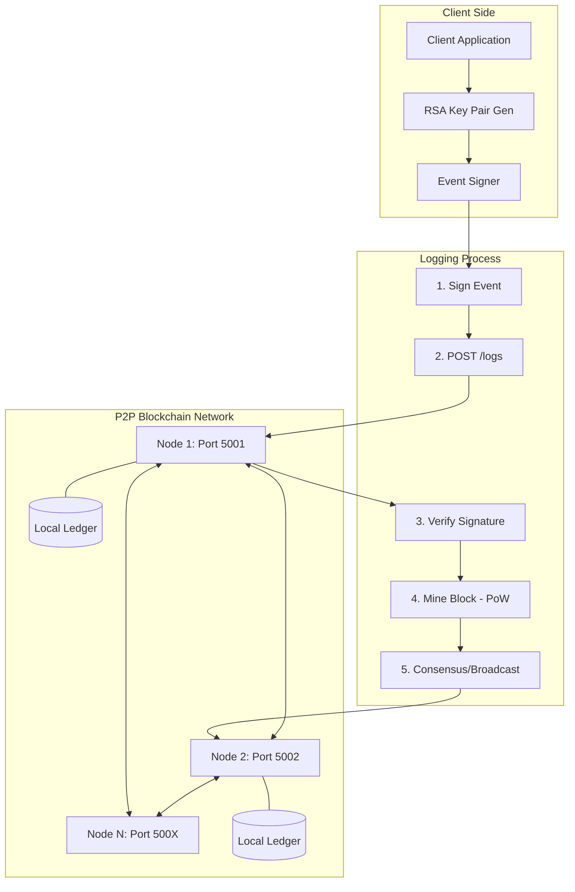

# Secure-Logging: Decentralized and Secure Blockchain Solution

A high-performance **Go-based** blockchain solution for tamper-proof logging events. This project ensures that log events are immutable once stored and can be verified using RSA-PSS digital signatures.

## System Architecture

The following diagram illustrates the interaction between clients and the decentralized logging network.



### Architecture Components Explained

1.  **Client Application**: Generates a unique RSA-2048 key pair. Each log entry is signed with the user's private key before being sent to the network.
2.  **RSA-PSS Signing**: Unlike simple signing, PSS (Probabilistic Signature Scheme) adds a salt to each signature, making it cryptographically more robust for secure logging.
3.  **Mining (Proof of Work)**: Each node competes to find a hash with a specific number of leading zeros (difficulty). This prevents spam and makes tampering with history computationally expensive.
4.  **P2P Consensus**: When a node finds a valid block, it broadcasts it to its peers. Nodes always follow the longest valid chain, ensuring eventual consistency across the network.
5.  **Immutability**: Since each block contains the `PreviousHash` of the parent block, changing a single log entry would require re-mining every subsequent block in the chain.

## Features

-   **Go Engine**: Re-implemented in Go for superior performance and concurrency.
-   **RSA-PSS Security**: Modern cryptographic standards for event verification.
-   **RESTful API**: Multi-node support with automated block propagation.
-   **Containerized**: Multi-stage Docker builds for minimal footprint.

## Getting Started

### Prerequisites

-   Docker & Docker Compose

### Running the Network

To start a decentralized network with two nodes:
```bash
docker-compose up --build
```
-   **Node 1**: `http://localhost:5001`
-   **Node 2**: `http://localhost:5002`

### API Interface

-   `POST /logs`: Submit a new log.
    -   `{"event": "User logged in", "public_key": "PEM...", "signature": "BASE64..."}`
-   `GET /chain`: View the current blockchain state.
-   `POST /nodes/register`: Add neighbor nodes URLs.
-   `POST /receive-block`: (Internal) Used for P2P block propagation.

## Why Go?

This project was migrated from Python to Go to take advantage of:
-   **True Parallelism**: Go routines allow nodes to handle networking and mining simultaneously without GIL bottlenecks.
-   **Strict Typing**: Ensures data integrity across the block structures.
-   **Static Binaries**: Reduced Docker image size and faster startup times.
