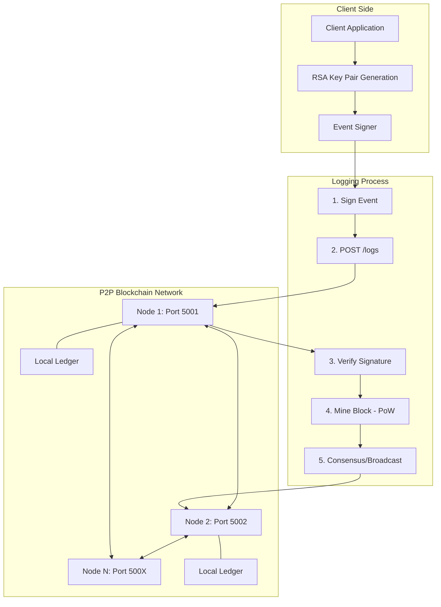

# Secure-Logging: Decentralized and Secure Blockchain Solution

This project provides a high-performance, Go-based blockchain solution designed for tamper-proof logging of system events. It ensures that log entries are immutable once recorded and can be cryptographically verified using RSA-PSS digital signatures.

## System Architecture

The interaction between clients and the decentralized logging network is illustrated in the diagram below.



## Project Structure

The project follows standard Go conventions for separating command-line tools from shared logic.

```text
Secure-Logging/
├── Dockerfile           (Multi-stage build configuration)
├── docker-compose.yml   (Network orchestration)
├── go.mod               (Dependency management)
├── src/
│   ├── cmd/
│   │   ├── client/      (Log submission tool)
│   │   └── server/      (Blockchain node implementation)
│   └── pkg/             (Shared library for blockchain and crypto)
│       ├── blockchain.go
│       ├── identity.go
│       └── blockchain_test.go
```

## Technical Implementation Details

### 1. Cryptographic Identity and Verification
Each client generates a unique RSA-2048 key pair. Log entries are signed using the Probabilistic Signature Scheme (RSA-PSS). Unlike simple PKCS#1 v1.5 signing, PSS includes a random salt for every signature generation, providing higher security against certain classes of cryptographic attacks. 

Nodes verify the signature of every incoming log post against the provided PEM-encoded public key before attempting to include it in the blockchain.

### 2. Blockchain and Immutability
The ledger is a sequence of blocks linked by cryptographic hashes. Each block contains:
- Index and Unix Timestamp
- Log Data (Event string, Public Key, Signature)
- Previous Block Hash
- Proof of Work (Nonce)

Because each block references the hash of the preceding block, any alteration to a historical log would require re-calculating the hashes for all subsequent blocks, which is computationally infeasible.

### 3. Proof of Work (PoW)
To prevent network spam and ensure data integrity, the system utilizes a Proof of Work mechanism. A node MUST find a block hash that starts with a specific number of leading zeros (controlled by the difficulty parameter). This process involves iterating a nonce (Proof) until the condition is met.

### 4. P2P Networking and Consensus
Nodes communicate over HTTP. When a node successfully mines a new block, it propagates the block to all registered neighbor nodes via the `/receive-block` endpoint. Receiving nodes validate the block's index, previous hash, and Proof of Work before appending it to their local ledger.

## Getting Started

### Prerequisites
- Docker and Docker Compose

### Running the Network
To initialize a decentralized network consisting of two nodes:
```bash
docker-compose up --build
```
The nodes will be accessible via:
- Node 1: http://localhost:5001
- Node 2: http://localhost:5002

### Using the Client
The project includes a client utility within the Docker container to demonstrate log submission.
```bash
# To run the client from within a new container
docker build -t secure-logging-client .
docker run --network host secure-logging-client /secure-logging-client
```

## API Documentation

### POST /logs
Submit a new log event to the node.
- Request Body: `{"event": "string", "public_key": "PEM string", "signature": "base64 string"}`
- Responses: 201 Created on success, 401 Unauthorized on signature failure.

### GET /chain
Retrieve the full blockchain from the node.
- Response: JSON object containing the chain array and its current length.

### POST /nodes/register
Register neighbor nodes to enable P2P synchronization.
- Request Body: `{"nodes": ["host1:port", "host2:port"]}`

### POST /receive-block
Internal endpoint used for block propagation between nodes.

## Development and Testing

The project uses Go's internal testing suite. To execute tests for the core logic:
```bash
go test ./src/pkg/... -v
```
